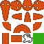

# SNAKE

<p align='center'></p>
<div id='id0'/>
# Index

1. [Enlace](#id111)
2. [Descripción](#id2)
3. [Estructura proyecto](#id3)
4. [Tecnologías empleadas](#id4)
5. [Recursos](#id5)
6. [Compilacion y Ejecución]
7. [Código](#id6)
8. [Licencias](#id7)
9. [Agradecimientos](#id8)
10. [?](#id9)
11. [?](#id10)
12. [?](#id11)
13. [?](#id12)
14. [?](#id13)

[](https://www.youtube.com/embed/OYXPH796qXE?start=127)

<div id='id111'/>

<a href='https://oobonioo.github.io/snake'>https://oobonioo.github.io/snake</a>

<div id='id1'/>

## Descripción

<!-- start slipsum code -->

<p>Look, just because I don't be givin' no man a foot massage don't make it right for Marsellus to throw Antwone into a glass motherfuckin' house, fuckin' up the way the nigger talks. Motherfucker do that shit to me, he better paralyze my ass, 'cause I'll kill the motherfucker, know what I'm sayin'? </p>

<p>Your bones don't break, mine do. That's clear. Your cells react to bacteria and viruses differently than mine. You don't get sick, I do. That's also clear. But for some reason, you and I react the exact same way to water. We swallow it too fast, we choke. We get some in our lungs, we drown. However unreal it may seem, we are connected, you and I. We're on the same curve, just on opposite ends. </p>

<p>Look, just because I don't be givin' no man a foot massage don't make it right for Marsellus to throw Antwone into a glass motherfuckin' house, fuckin' up the way the nigger talks. Motherfucker do that shit to me, he better paralyze my ass, 'cause I'll kill the motherfucker, know what I'm sayin'? </p>

<p>Do you see any Teletubbies in here? Do you see a slender plastic tag clipped to my shirt with my name printed on it? Do you see a little Asian child with a blank expression on his face sitting outside on a mechanical helicopter that shakes when you put quarters in it? No? Well, that's what you see at a toy store. And you must think you're in a toy store, because you're here shopping for an infant named Jeb. </p>

<!-- end slipsum code -->
<div id='id2'/>

## Tecnología empleada

- NodeJS https://nodejs.org/
- Typescript https://www.typescriptlang.org/
- ESLint https://eslint.org/
- Lodash https://www.npmjs.com/package/lodash

[Inicio](#id0)

<div id='id3'/>

## Estructura proyecto

[Inicio](#id0)

<div id='id4'/>

## Compilacion y Ejecución

Hacer .....

```sh
git clone https://github.com/oOBoniOo/serpiente_mid_cnwd.git
cd serpiente_mid_cnwd
yarn init -y
yarn install
yarn run dev
```

[Inicio](#id0)

<div id='id5'/>

## Recursos

### Sprites

<p align='center'></p>

## Código de ejemplo

[Inicio](#id0)

<div id='id6'/>

## Licencias

[Inicio](#id0)

<div id='id7'/>

## Agradecimientos

[Inicio](#id0)
