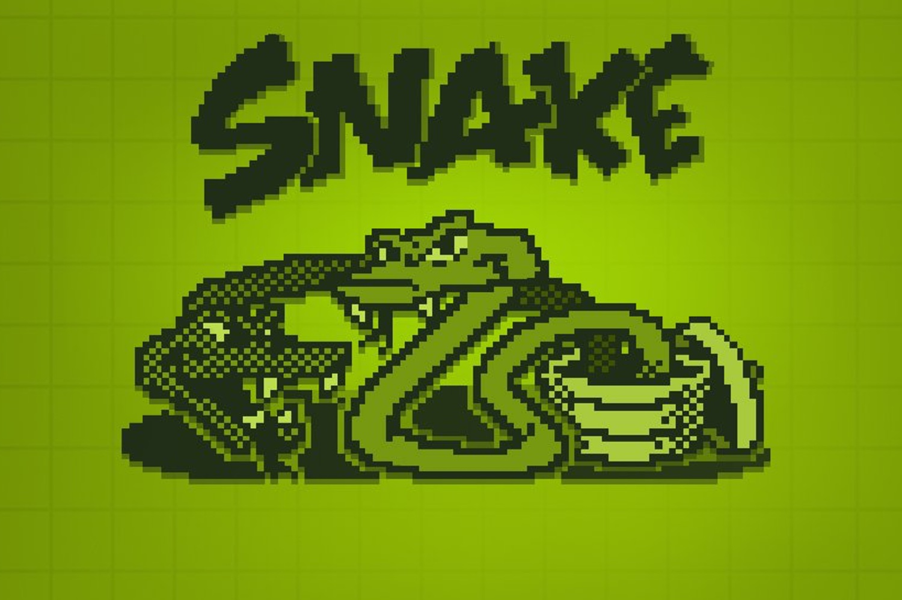
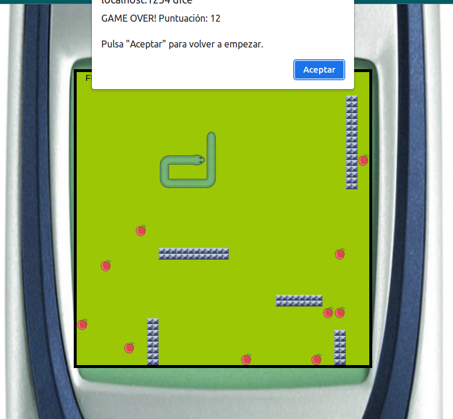
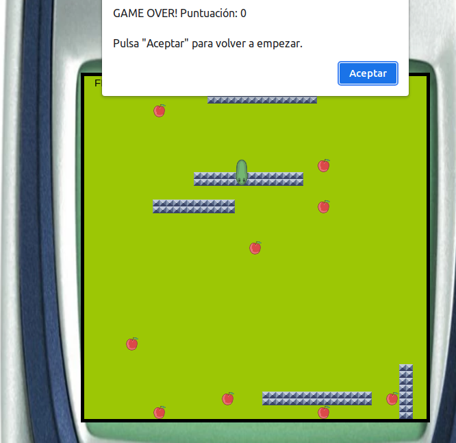
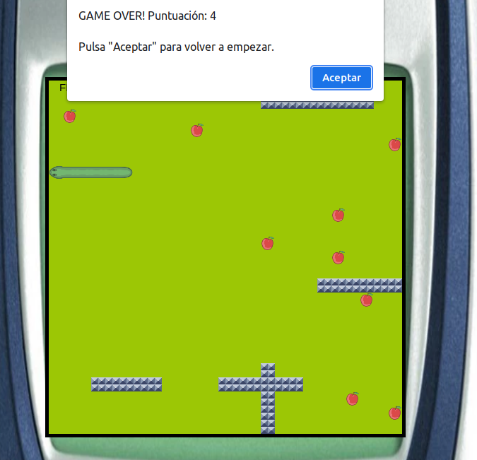
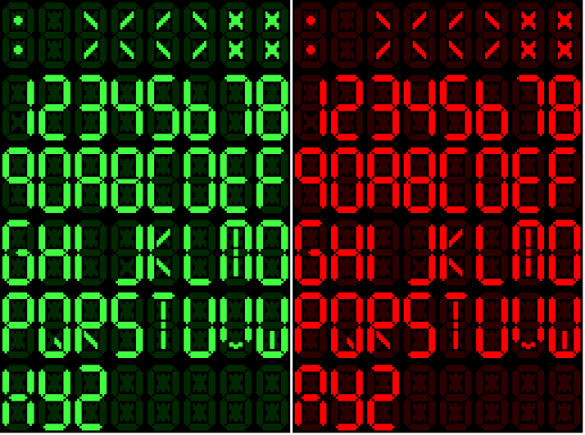
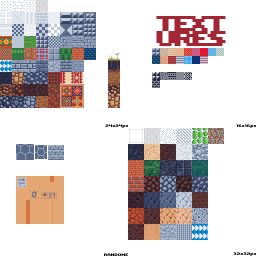

# SNAKE

<p align='center'></p>
<div id='id0'/>
# Index

1. [Enlace](#id1)
2. [Descripción](#id2)
3. [Estructura proyecto](#id4)
4. [Tecnologías empleadas](#id3)
5. [Recursos](#id5)
6. [Compilacion y Ejecución](#id6)
7. [Referencias](#id7)
8. [Licencias](#id7)
9. [Agradecimientos](#id8)

[](https://www.youtube.com/embed/OYXPH796qXE?start=127)

<div id='id1'/>

## Enlace al juego:

<a href='https://oobonioo.github.io/snake'>https://oobonioo.github.io/snake</a>

<div id='id2'/>

## Descripción

<p>Juego basádo en el clásico de la serpiente del antiguo movil Nokia 3310. Se han añadido algunas texturas y objetos en el juego con los que poder interactuar.</p>

<p>El movimiento en el area de juego trata de imitar el movimiento por "bloques" que se efectuava en el movil. </p>
<p align='center'></p>
<p align='center'></p>
<p align='center'></p>
<p>Los objetos "feed" suman puntos al marcador, mientras que cualquier choque con un obstáculo, borde o el propio cuerpo de la serpiente, forzará la finalización del juego. </p>

<p>TOdavia queda pendiente la incrporación de algún actor mas al juego.</p>

<div id='id3'/>

## Tecnología empleada

- NodeJS https://nodejs.org/
- yarn https://classic.yarnpkg.com/en/
- Typescript https://www.typescriptlang.org/
- Lodash https://www.npmjs.com/package/lodash
- fs-extra https://www.npmjs.com/package/fs-extra
- github https://github.com/oOBoniOo
- ghPages (despliegue del juego)

[Inicio](#id0)

<div id='id4'/>

## Estructura proyecto

El proyecto esta dividido en directorios con los archivos ts a su vez separados por actores, script principal, utilidades y controladores.

- `src`:
  - `actors`:
    - `Actors.ts`: Aqui esta definido el la interface y clase actor de la que heredan todos los actores del juego.
    - `BodyPArts.ts`: Representa cada una de las partes del cuerpo de la serpiente.
    - `Chronometer.ts`: _No usado_ se espera usar en el futuro para guardar tiempos, puntuaciones y mas funcionalidades.
    - `Feed.ts`: Con el modulo feed conseguimos crear cada una de las "comidas" que la serpiente tendra en el area de juego.
    - `FPSViewer.ts`: visor de FPS
    - `Map.ts`: con la clase mapa, almacenamos y gestionamos las posiciones donde no podrán aparecer objetos puesto que ya estan ocupadas-
    - `Obstacle.ts`: Representa cada uno de los obstaculos que se crean ene le juego.
    - `PointCounter.ts`: con este modulo, pintamos la puntuacion en el canvas.
  - `assets`:
    - `sprites`: tesxturas usadas para representar los objetos del juego.
  - `state`:
    - `Objets`: este modulo se encarga de gestionar los objetos extra(todo menos la serpiente) que aparecen en el juego.
  - `types`:
    - `Coords.ts`: tipo de las coordenadas de los obstaculos
    - `Point.ts`: tipo para las ubicaciones de los actores.
    - `Size.ts`: tipo para los tamaños.
  - `utils`:
    - `checkLimits.ts`: controla los limites del juego para el choque de la serpiente.
    - `keyboardMap.ts`: controla las pulsaciones de las teclas.
  - `script.ts`: controlador principal del juego(renderizado, inicialización de actores)

Para los archivos multimedia y hojas de estilos se ha utilizado el directorio "public"

[Inicio](#id0)

<div id='id5'/>

## Compilacion y Ejecución

Si queremos ejecutar con parcel:

```sh
git clone https://github.com/oOBoniOo/serpiente_mid_cnwd.git
cd serpiente_mid_cnwd
yarn init -y
yarn install
yarn run dev
```

Para el despliegue en ghPages:

```sh
  yar run ghbuild
```

[Inicio](#id0)

<div id='id6'/>

## Recursos

### Sprites

<p align='center'></p>
<p align='center'></p>
<p align='center'></p>

<div id='id7'/>

## Referencias:

Me sirvió de orientacion para el mapa y el "recorte" de los sprites este repositorio:

<a href='  https://github.com/CodingWith-Adam/snake/blob/main/index.js
'> https://github.com/CodingWith-Adam/snake/blob/main/index.js
</a>

[Inicio](#id0)

<div id='id7'/>

## Licencias

[Inicio](#id0)

<div id='id8'/>

## Agradecimientos

[Inicio](#id0)
